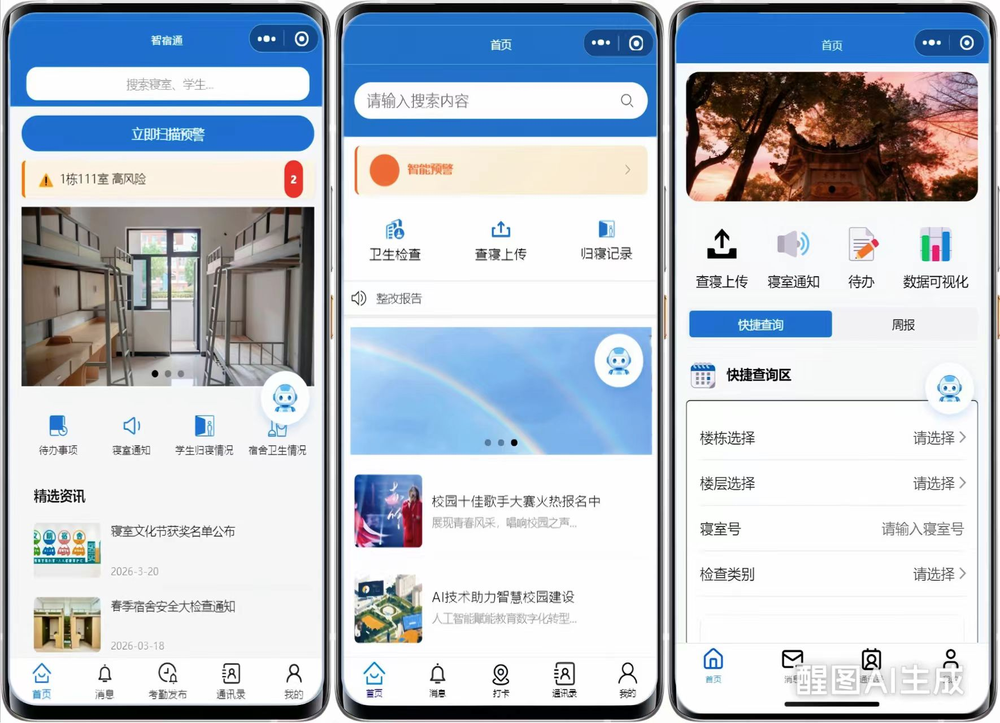
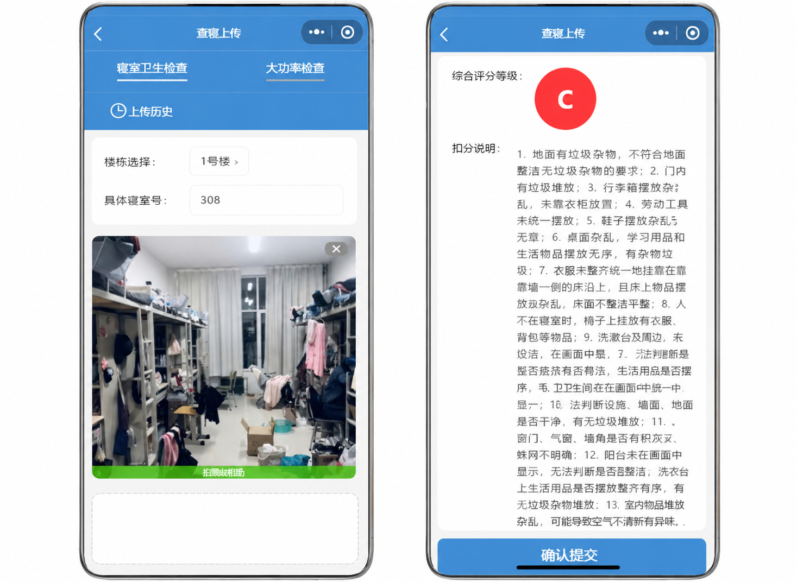
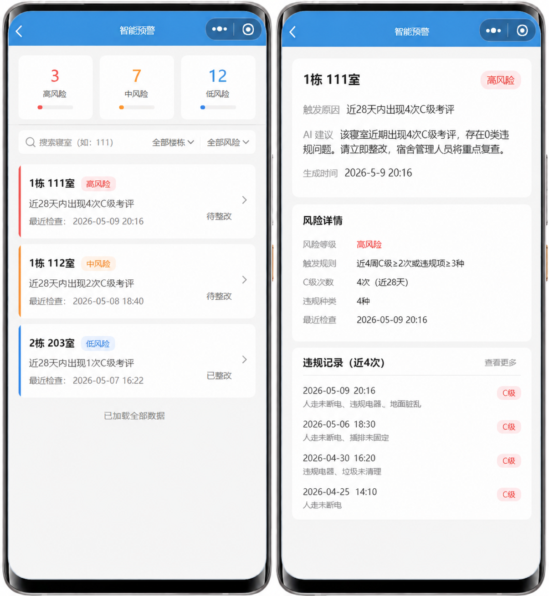
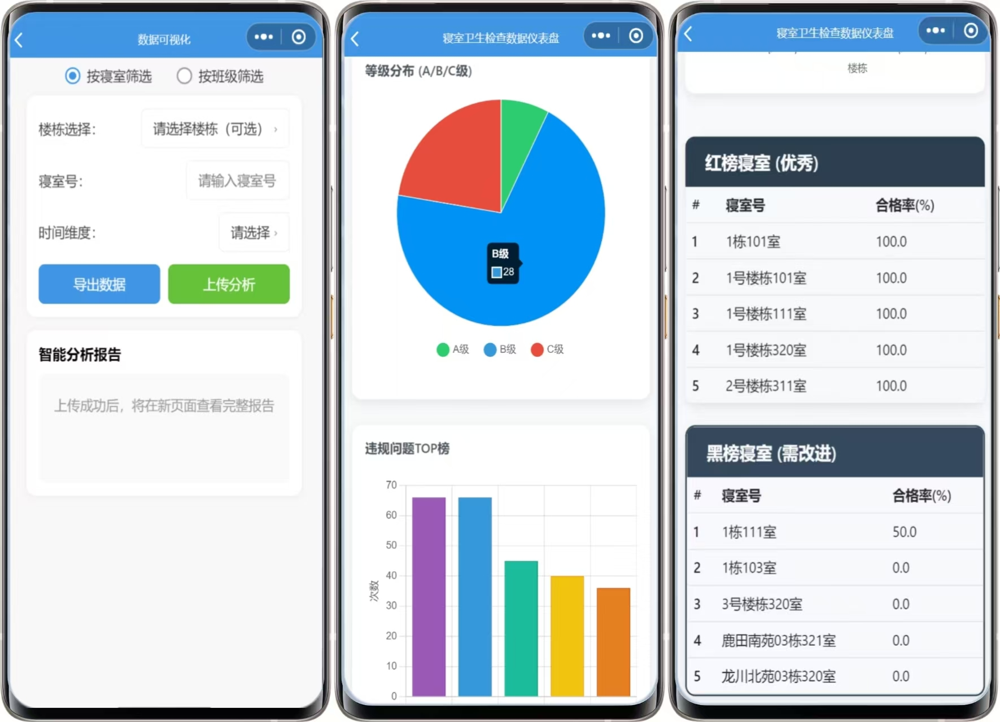
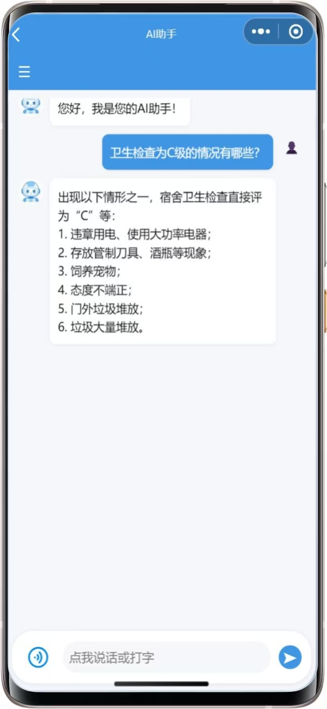

# ai-drom-management
# 智宿通（AI Dormitory Management System）

基于 Django + DRF + UniApp + AIGC 的高校宿舍一体化智能管理平台。

项目融合 AI 视觉识别、大模型文本生成、智能预警、数据可视化等能力，构建“智能查寝 → 风险预警 → 整改闭环 → 数据分析”的全流程宿舍管理体系。

---

# 项目简介

智宿通是一套面向高校场景的 AI 宿舍管理平台，旨在解决传统宿舍管理中：

- 人工查寝效率低
- 违规识别易漏项
- 风险寝室发现滞后
- 数据统计繁琐
- 学生办事体验差

等核心问题。

系统通过 AI 视觉识别、AIGC 文本生成、实时预警、多角色协同等技术，实现宿舍管理智能化、自动化、数字化。

---

# 项目亮点
# 项目截图

## 系统首页



---

## AI违规识别



---

## 智能预警模块



---

## 数据可视化分析



---

## AI助手模块


## AI视觉违规识别

宿管拍摄宿舍照片后：

- 自动识别 21 类违规问题
- 自动生成 A/B/C 等级
- 自动生成整改建议
- 自动归档检查记录

实现：

> “拍照即检查，检查即记录”

---

## 智能风险预警

系统基于：

- 最近 4 周检查记录
- C级违规次数
- 违规类型数量

自动识别高风险寝室。

并：

- AI生成风险等级
- AI生成整改建议
- 自动推送辅导员
- 自动进入重点复查名单

实现：

> “事后处理 → 事前预警”

---

## AI数据可视化分析

上传 Excel 后：

系统自动：

- 统计合格率
- 分析违规 TOP 榜
- 生成柱状图/饼图
- 输出完整 HTML 可视化报告

实现：

> “一键生成宿舍管理分析报告”

---

## AI整改报告生成

系统根据：

- 宿舍评分
- 违规项
- 检查备注

自动生成：

- 整改建议
- 整改期限
- 整改报告

减少人工文案工作。

---

## AI智能问答

结合宿舍规则库：

支持学生自然语言提问：

- 宿舍规定
- 卫生标准
- 请假流程
- 违规处理

提升学生服务效率。

---

# 技术架构

## 后端技术栈

- Django
- Django REST Framework
- Django Channels
- JWT
- RBAC 权限控制
- SQLite / MySQL

---

## 前端技术栈

- UniApp
- Vue

---

## AI能力接入

### 豆包视觉模型

用于：

- 宿舍违规识别
- 卫生评级
- 图像理解

模型：

```python
doubao-1-5-vision-pro-32k-250115
```

---

### 豆包文本模型

用于：

- 整改报告生成
- 周报生成
- 智能预警
- 翻译
- 智能问答

模型：

```python
Doubao-Seed-2.0-lite
```

---

### DeepSeek 大模型

用于：

- Excel 数据解析
- HTML 可视化页面生成
- 数据分析报告生成

模型：

```python
Volc-DeepSeek-V3.2
```

---

### vivo ASR

用于：

- 实时语音识别
- AI语音助手

---

# 核心功能模块

## 1. 智能考评巡检模块

功能：

- AI视觉违规识别
- 自动卫生评级
- 自动整改建议
- 检查记录归档

支持：

- 大功率电器识别
- 私拉电线识别
- 地面垃圾识别
- 卫生问题识别

---

## 2. 智能预警整改模块

功能：

- 风险寝室识别
- AI预警生成
- 整改建议生成
- 教师端预警推送

支持：

- 红橙黄三级预警
- 闭环整改追踪
- 自动重点复查

---

## 3. AI数据可视化模块

功能：

- Excel 自动解析
- 数据分析
- 图表生成
- HTML报告生成

支持：

- 合格率统计
- 等级分布
- TOP违规排行
- 楼栋分析

---

## 4. AI助手模块

功能：

- 智能问答
- 语音交互
- 规则咨询
- 宿舍服务咨询

支持：

- 长按语音输入
- AI文本回复
- AI语音回复

---

## 5. 学生服务模块

功能：

- 请假申请
- 整改通知查看
- 宿舍信息查看
- 消息通知

---

# 项目结构

```bash
SheXingDjango/
│
├── attendance/          # 考勤与请假模块
├── dorm/                # 宿舍管理核心模块
├── users/               # 用户与权限模块
├── templates/           # HTML模板
├── media/               # 上传文件
├── staticfiles/         # 静态资源
│
├── manage.py
└── requirements.txt
```

---

# 项目启动

## 1. 克隆项目

```bash
git clone https://github.com/你的用户名/ai-drom-management.git
```

---

## 2. 创建虚拟环境

```bash
python -m venv venv
```

---

## 3. 激活虚拟环境

Windows：

```bash
venv\Scripts\activate
```

Git Bash：

```bash
source venv/Scripts/activate
```

---

## 4. 安装依赖

```bash
pip install -r requirements.txt
```

---

## 5. 配置环境变量

创建 `.env`

```env
DOUBAO_API_KEY=你的key
BLUELM_API_KEY=你的key
VIVO_DEEPSEEK_API_KEY=你的key
```

---

## 6. 启动项目

```bash
python manage.py runserver
```

---

# 权限设计

系统采用：

- JWT 登录认证
- RBAC 权限控制

实现：

- 学生端
- 宿管端
- 教师端
- 管理员端

多角色权限隔离。

---

# 项目创新点

## 1. AI替代传统人工查寝

实现：

- 秒级违规识别
- 自动评级
- 自动归档

显著提升宿舍管理效率。

---

## 2. 风险主动预警机制

创新：

> “统计阈值 + 大模型语义分析”

双层预警机制。

---

## 3. 多模型协同架构

融合：

- 豆包
- DeepSeek
- vivo ASR

形成：

> “统一调度 + 专项能力增强”

AI服务体系。

---

## 4. 全流程闭环管理

形成：

```text
检查 → 预警 → 整改 → 复查 → 数据分析
```

完整业务闭环。

---

# 我的职责

本人主要负责：

- Django 后端开发
- DRF 接口设计
- 数据模型设计
- AI模块接入
- AI预警逻辑开发
- 数据可视化后端生成
- WebSocket实时通知
- JWT认证与权限控制
- 系统整体后端架构设计

前端由团队成员基于 UniApp + Vue 开发。

---

# 项目效果

- AI识别时间 < 3秒
- 接口响应时间 < 1秒
- 支持多角色协同管理
- 支持移动端微信小程序
- 实现宿舍管理全流程数字化

---

# 项目前景

项目面向高校智慧校园建设场景。

适用于：

- 高校宿舍管理
- 学工处
- 后勤管理
- 学生事务管理

具备较强的推广与落地价值。

---

# License

MIT License
